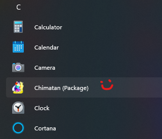

# RichStrategy
- Investment Simulator And Auto Trader.
- This is only a QA Test Project for learning purposes.
- Helps you visualize trends and calculate indicators, even verifying your strategy in real-time simulations.
- Do Not Try Earning Anything With It.
- YOU WILL LOSE MONEY IF YOU WANT QUICK MONEY.
- THERE IS NO QUICK MONEY.
- YOU SHOULD MODIFY [GateIO.cs] ACCORDINGLY BEFORE BUILDING IT.

## Target Platforms
- Windows 10
- Other platforms with .NET core 5.0 and/or above

## Notice
Current Progress:

This project branch has been discontinued, and this repo is for recording only.

Newer iteration (ongoing, private, offline development):

